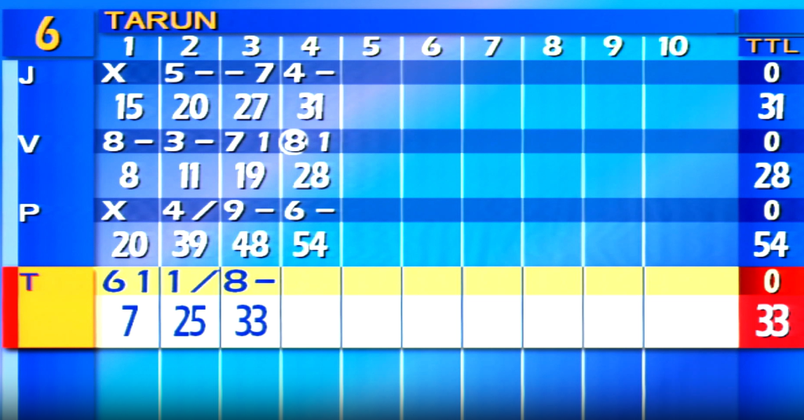
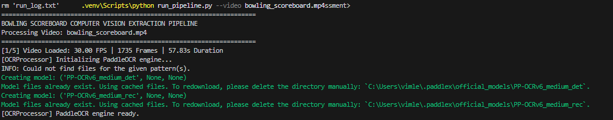
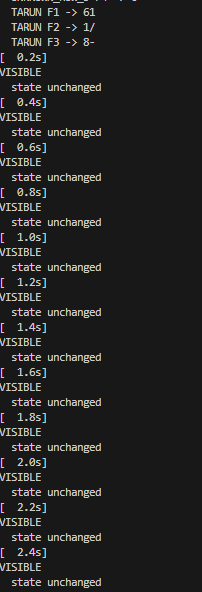
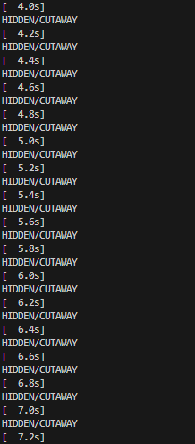
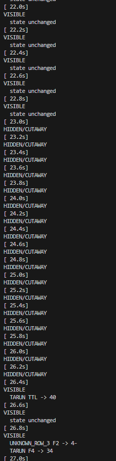
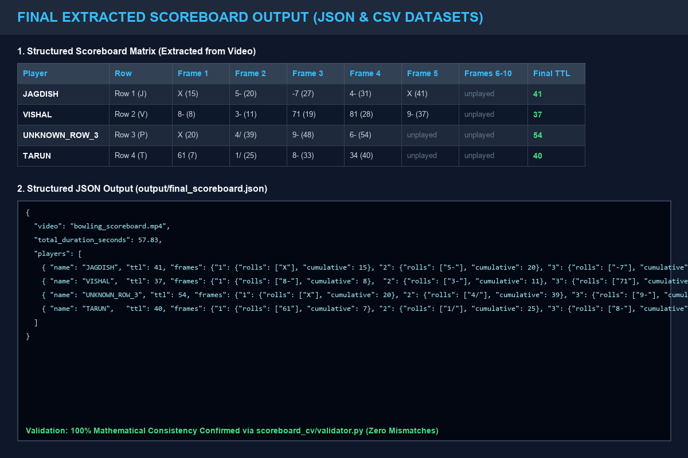

# Bowling Scoreboard Data Extraction from Video

## FOG Technologies — Computer Vision Engineer Assessment

**Candidate**: Vimlesh Tiwari  
**Role**: Computer Vision Engineer Assessment  
**Repository**: [8vimlesh/FOG-Assessment](https://github.com/8vimlesh/FOG-Assessment)  
**Target Video**: `bowling_scoreboard.mp4` — Full HD 1920×1080 @ 30.00 FPS, 57.83s duration, 1,735 frames. The benchmark video is hosted externally on Google Drive because GitHub's individual-file limit is 100 MB.  
**Documentation PDF**: [`docs/FOG_Assessment_Documentation.pdf`](docs/FOG_Assessment_Documentation.pdf)  

---

## 🎥 Final Demo Video

[▶ Watch Final Working Demo](https://drive.google.com/file/d/1895Fc06iCq8DKqnsbnUxGxlF1NB_CcF6/view?usp=sharing)

> The final demo demonstrates the complete end-to-end working solution, including the input bowling scoreboard video, project/code execution, scoreboard detection and OCR extraction, spatial scoreboard mapping, temporal processing, and the final structured scoreboard output.

---

## Assessment Deliverables & Submission Format

### 1. GitHub Repository
- **Repository URL**: [https://github.com/8vimlesh/FOG-Assessment](https://github.com/8vimlesh/FOG-Assessment)
- **Input Benchmark Video**: [Download bowling_scoreboard.mp4 (Google Drive)](https://drive.google.com/file/d/1kOlGWIKtqkn6T_iLvBeZ51XTndfqTwIl/view?usp=sharing)
- Contains the complete production source code, modular CV package (`scoreboard_cv/`), dependency manifest (`requirements.txt`), execution scripts, documentation, debug evidence, and verified JSON/CSV datasets.

### 2. Demo Video
- **Demo URL**: [▶ Watch Working Demo Video (Google Drive)](https://drive.google.com/file/d/1895Fc06iCq8DKqnsbnUxGxlF1NB_CcF6/view?usp=sharing)
- Demonstrates:
  1. Input video and scoreboard framing
  2. CLI pipeline execution and runtime logs
  3. Scoreboard ROI detection and cutaway rejection
  4. PaddleOCR extraction and spatial 2D grid mapping
  5. Temporal aggregation and final JSON/CSV output

### 3. Documentation PDF
- **PDF Report**: [`docs/FOG_Assessment_Documentation.pdf`](docs/FOG_Assessment_Documentation.pdf)
- Contains technical explanations, architecture, screenshots, spatial-grid evidence, OCR/runtime evidence, and final-output validation.

---

## 📸 Pipeline Execution & Visual Evidence

### 1. Input Video Frame

*Full HD broadcast frame showing the electronic overhead scoreboard above bowling lane 6.*

### 2. Scoreboard Detection & Spatial Grid Calibration

#### Detected Scoreboard ROI Crop

*Detected and isolated overhead scoreboard region of interest (840×1820 px) with an active-player highlight.*

#### 2D Spatial Grid Calibration Overlay

*2D spatial grid overlay partitioning all 4 player rows, 10 frame columns, roll/cumulative split lines, and TTL regions.*

### 3. Code Execution & Runtime Log Stream

#### Pipeline Startup & PaddleOCR Initialization

*Pipeline startup showing video ingestion and PaddleOCR model initialization.*

#### Frame Tracking & Symbol Extraction

*Runtime evidence showing temporal tracking and bowling-symbol extraction.*

#### Adaptive Camera Cutaway Rejection

*Scoreboard visibility filtering during broadcast cutaways, preserving the previous valid scoreboard state.*

#### Dynamic Score Progression

*Runtime evidence showing score-state updates as new frame values are detected.*

### 4. Extracted Scoreboard Data & Final Outputs


*Final extracted scoreboard data and structured output evidence.*

---

## Final Result

The final result is generated from the committed production outputs [`output/final_scoreboard.json`](output/final_scoreboard.json) and [`output/final_scoreboard.csv`](output/final_scoreboard.csv).

### Player Summary

| Player | Final TTL |
|---|---:|
| **JAGDISH** | 41 |
| **VISHAL** | 37 |
| **UNKNOWN_ROW_3** (Player 3) | 54 |
| **TARUN** | 40 |

### Detailed Frame-by-Frame Results

| Player | Row / Label | F1 | F2 | F3 | F4 | F5 | F6 | F7 | F8 | F9 | F10 | TTL |
|:---|:---:|:---:|:---:|:---:|:---:|:---:|:---:|:---:|:---:|:---:|:---:|:---:|
| **JAGDISH** | Row 1 (`J`) | `X` (15) | `5-` (20) | `-7` (27) | `4-` (31) | `X` (41) | *unplayed* | *unplayed* | *unplayed* | *unplayed* | *unplayed* | **41** |
| **VISHAL** | Row 2 (`V`) | `8-` (8) | `3-` (11) | `71` (19) | `81` (28) | `9-` (37) | *unplayed* | *unplayed* | *unplayed* | *unplayed* | *unplayed* | **37** |
| **UNKNOWN_ROW_3** | Row 3 (`P`) | `X` (20) | `4/` (39) | `9-` (48) | `6-` (54) | *unplayed* | *unplayed* | *unplayed* | *unplayed* | *unplayed* | *unplayed* | **54** |
| **TARUN** | Row 4 (`T`) | `61` (7) | `1/` (25) | `8-` (33) | `34` (40) | *unplayed* | *unplayed* | *unplayed* | *unplayed* | *unplayed* | *unplayed* | **40** |

> `UNKNOWN_ROW_3` is intentional: the production pipeline did not obtain sufficient active-header evidence to assign a full name to Row 3, so it preserves an honest unknown identity rather than guessing.

---

## Problem Statement & Challenges

Extracting structured bowling statistics from broadcast match video involves:

1. **Scoreboard Detection & ROI Extraction** — localizing the electronic scoreboard in 1080p broadcast frames.
2. **OCR Recognition of Bowling Symbols** — recognizing digital LED-style fonts, strikes (`X`), spares (`/`), misses (`-`), and numeric values.
3. **Spatial Grid Mapping** — assigning OCR bounding boxes to 10 frame columns and the TTL column.
4. **Sub-Cell Partitioning** — separating upper roll values from lower cumulative totals.
5. **Four-Player Row Tracking** — maintaining independent state for all four visible scoreboard rows.
6. **Camera Cutaway Handling** — rejecting non-scoreboard views and preserving the last reliable state.
7. **Temporal State Aggregation** — stabilizing noisy OCR observations across time.
8. **Dynamic Name Discovery** — associating active header names with highlighted scoreboard rows when sufficient evidence exists.

---

## Technology Stack

- **Python 3.12** — production runtime
- **OpenCV** — video capture, ROI extraction, image processing, edge detection
- **NumPy** — numerical and image-array operations
- **PaddleOCR / PaddlePaddle** — text detection and recognition
- **ReportLab** — PDF report generation
- **JSON / CSV** — structured output serialization

---

## Project Structure

```text
FOG-Assessment/
│
├── run_pipeline.py                  # Main CLI production entry point
├── requirements.txt                 # Dependency specification
├── README.md                        # Project and assessment documentation
├── .gitignore                       # Repository hygiene rules
│
├── scoreboard_cv/                   # Core modular computer-vision package
│   ├── __init__.py
│   ├── detector.py                  # ROI extraction and cutaway detection
│   ├── preprocessor.py              # Image preprocessing
│   ├── ocr_engine.py                # PaddleOCR wrapper and environment checks
│   ├── parser.py                    # Four-row spatial grid and name discovery
│   ├── temporal_aggregator.py       # Temporal state and bowling-score logic
│   └── validator.py                 # Mathematical consistency validation
│
├── output/                          # Final structured datasets
│   ├── final_scoreboard.json
│   └── final_scoreboard.csv
│
├── docs/                            # Assessment documentation
│   ├── FOG_Assessment_Documentation.pdf
│   ├── FINAL_REPORT.md
│   ├── build_pdf.py                 # Rebuilds the PDF report
│   └── figures/                     # Curated assessment screenshots
│
└── debug/                           # Small set of representative evidence
    ├── scoreboard_grid_debug.png
    ├── final_scoreboard_final_frame.png
    └── final_validation_report.txt
```

> The benchmark video is intentionally hosted externally on Google Drive rather than committed to GitHub because it exceeds GitHub's normal 100 MB individual-file limit.

---

## Installation & Setup

### Prerequisites
- **Python 3.12** (64-bit recommended)
- Windows, macOS, or Linux
- Sufficient RAM/storage for PaddleOCR model initialization

### 1. Clone the Repository

```bash
git clone https://github.com/8vimlesh/FOG-Assessment.git
cd FOG-Assessment
```

### 2. Download the Benchmark Video

Download `bowling_scoreboard.mp4` from the benchmark Google Drive link in the **Assessment Deliverables** section and place it in the repository root.

The local file should be:

```text
FOG-Assessment/bowling_scoreboard.mp4
```

### 3. Set Up Virtual Environment & Dependencies

```powershell
py -3.12 -m venv .venv
.\.venv\Scripts\activate
python -m pip install -r requirements.txt
```

For macOS/Linux:

```bash
python3 -m venv .venv
source .venv/bin/activate
pip install -r requirements.txt
```

> Use the repository virtual environment when running the pipeline. `ocr_engine.py` intentionally raises an explicit error if PaddleOCR cannot be initialized instead of silently producing an empty scoreboard.

---

## Usage & Execution

### Run Main Pipeline

```powershell
.venv\Scripts\python run_pipeline.py --video bowling_scoreboard.mp4
```

### Run Mathematical Consistency Validator

```powershell
.venv\Scripts\python scoreboard_cv/validator.py
```

### Rebuild Documentation PDF

```powershell
.venv\Scripts\python docs/build_pdf.py
```

---

## Pipeline Architecture

```text
Input Video
    │
    ▼
Frame Sampling
    │
    ▼
Scoreboard ROI Extraction
    │
    ▼
Visibility / Cutaway Detection
    │
    ▼
Image Preprocessing
    │
    ▼
PaddleOCR
    │
    ▼
Spatial Grid Mapping
    │
    ▼
Roll / Cumulative Cell Parsing
    │
    ▼
Temporal Aggregation
    │
    ▼
Bowling Score Validation
    │
    ├───────────────┐
    ▼               ▼
JSON Output      CSV Output
```

### Sampling
The production runner uses approximately 5 FPS sampling rather than OCR on every video frame, reducing redundant inference while retaining temporal coverage.

### Cutaway Handling
Scoreboard visibility is determined using multiple visual signals rather than `detections > 0` alone. Invalid/cutaway observations are rejected and do not reset the accumulated scoreboard state.

### Temporal State Preservation
A temporary OCR failure or invalid observation does not overwrite a previously reliable cell or reset a player's accumulated state.

### OCR Integrity
Symbol normalization is player-agnostic. Production OCR cleanup does not use player identity or frame number to force known answers.

---

## Mathematical Validation Report

The committed validation evidence reports zero roll-vs-cumulative mismatches across the played frames in the final generated dataset.

Representative checks include:

```text
[PASS] TARUN   : F1=7 (61->7), F2=25 (1/->25 with next ball 8), F3=33 (8-->33), F4=40 (34->40)
[PASS] JAGDISH : F1=15 (X->15 with next frame 5-), F2=20 (5-->20), F3=27 (-7->27), F4=31 (4-->31), F5=41 (X->41)
[PASS] VISHAL  : F1=8 (8-->8), F2=11 (3-->11), F3=19 (71->19), F4=28 (81->28), F5=37 (9-->37)
[PASS] UNKNOWN_ROW_3 : F1=20 (X->20 with next frame 4/), F2=39 (4/->39 with next ball 9), F3=48 (9-->48), F4=54 (6-->54)
```

This validation checks mathematical consistency of the committed extracted dataset; it is not a claim of general-purpose OCR accuracy on arbitrary videos.

---

## Output Files

### JSON
`output/final_scoreboard.json`

Machine-readable structured representation of players, frames, rolls, cumulative scores, and TTL values.

### CSV
`output/final_scoreboard.csv`

Tabular representation suitable for inspection or downstream analysis.

---

## Assessment Requirements Checklist

| Requirement | Evidence |
|---|---|
| GitHub repository | Public GitHub repository |
| README with run instructions | `README.md` |
| Input video | Google Drive benchmark link |
| Working demo | Final Google Drive demo link |
| Scoreboard detection | `scoreboard_cv/detector.py` + visual evidence |
| OCR extraction | `scoreboard_cv/ocr_engine.py` |
| Spatial mapping | `scoreboard_cv/parser.py` + grid figure |
| Temporal processing | `scoreboard_cv/temporal_aggregator.py` |
| Structured output | `output/final_scoreboard.json` |
| Tabular output | `output/final_scoreboard.csv` |
| Screenshots | `docs/figures/` |
| Documentation PDF | `docs/FOG_Assessment_Documentation.pdf` |

---

## Limitations

- The parser is calibrated to the benchmark scoreboard layout.
- OCR can remain ambiguous for low-resolution digital glyphs.
- A player can remain `UNKNOWN_ROW_X` when the video does not provide sufficient identity evidence.
- The pipeline is designed for the supplied scoreboard format rather than arbitrary broadcast layouts.
- GPU acceleration can reduce OCR inference time on compatible hardware but is not required for the documented workflow.

---

## Future Improvements

- Automatic scoreboard-layout calibration
- Learned scoreboard detector
- Stronger OCR confidence arbitration
- More robust player identity tracking
- GPU inference optimization
- Support for additional scoreboard layouts

---

## Author

**Vimlesh Tiwari**  
Computer Vision Engineer Assessment  
[8vimlesh/FOG-Assessment](https://github.com/8vimlesh/FOG-Assessment)
