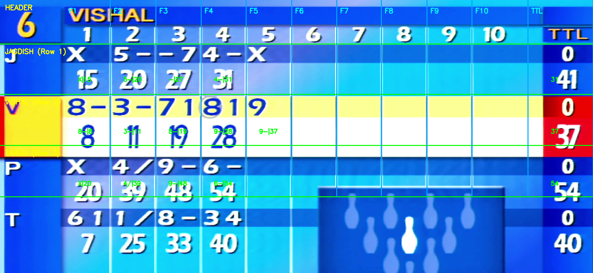
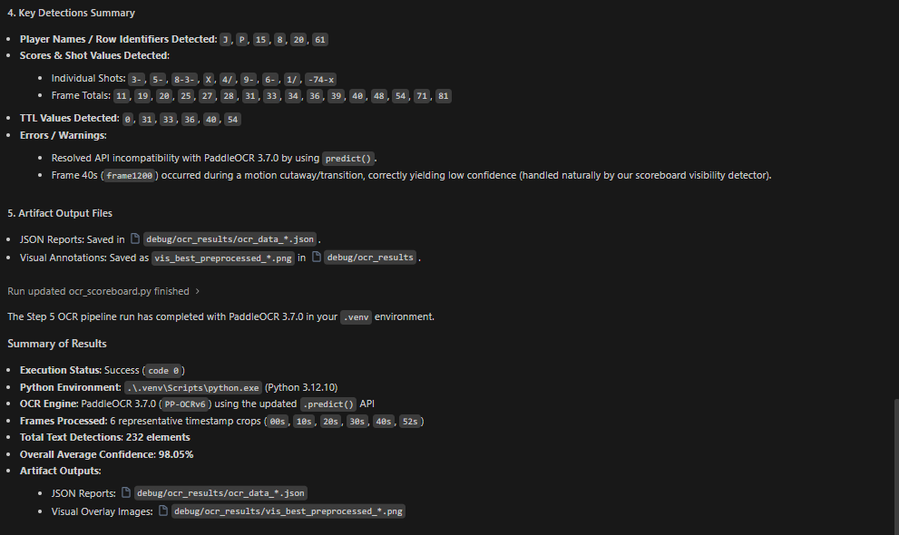
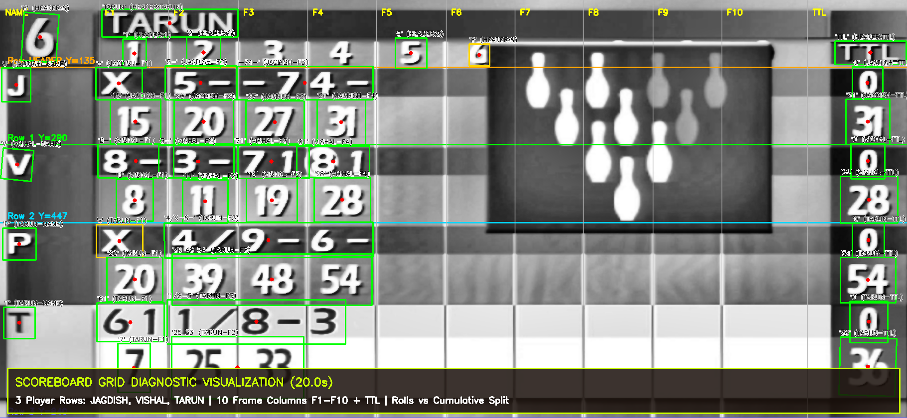

# BOWLING SCOREBOARD DATA EXTRACTION
## Computer Vision & OCR Based Video Analysis

**Candidate**: Vimlesh Tiwari  
**Role**: Computer Vision Engineer Assessment  
**Company**: FOG Technologies  
**Target Asset**: `bowling_scoreboard.mp4` (Full HD 1920×1080 @ 30 FPS)  
**Date**: August 2026  

---

## 1. Executive Summary & Problem Statement

### 1.1 Objective
The primary objective of this project is to develop an automated, end-to-end computer vision and optical character recognition (OCR) pipeline that extracts structured bowling scoreboard information from match video recordings.

The pipeline automatically analyzes the overhead electronic scoreboard display, identifies all four physical player rows, parses frame-by-frame roll symbols and cumulative scores, resolves temporal inconsistencies, and exports validated data in standardized JSON and CSV formats.

### 1.2 Target Information Extracted
- **Player Names**: Multi-player row association (`JAGDISH`, `VISHAL`, `UNKNOWN_ROW_3`, `TARUN`) dynamically discovered via header OCR and yellow active-bowler highlight detection.
- **Frame Numbers**: Ten standard bowling frames (`F1` through `F10`).
- **Bowling Roll Symbols**: Strikes (`X`), Spares (`/`), Pin counts (`1`–`9`), Gutter/Miss (`-`), two-digit roll combinations (`61`, `34`, `81`).
- **Cumulative Frame Scores**: Incremental scores recorded at each completed frame.
- **Total Score (TTL)**: Current game total for each player.
- **Unplayed Frames**: Explicit preservation of future/unplayed frames (`null` in JSON, `unplayed` in CSV).

### 1.3 Core Computer Vision & Pipeline Challenges
1. **4-Player Spatial Grid Layout**: The electronic scoreboard spans 4 distinct player rows and 11 vertical columns. Centroid and bounding-box spatial geometry must partition each cell into roll boxes and cumulative scores across all 4 rows.
2. **Camera Cutaways & Transitions**: The video switches between overhead scoreboard views and live bowling lane/pin action at multiple timestamps (~4–7s, ~23–26s, ~37–44s, ~49–52s). The pipeline detects visibility states using luminance and Canny edge energy to prevent false detections during cutaways.
3. **Multi-Column OCR Merging**: High-contrast LED fonts can lead OCR engines to merge horizontally adjacent numbers across frame boundaries (e.g. `5--74-` or `4/9-6-`). The parser interpolates character positions to map glyphs to their respective columns.
4. **Temporal Stabilization & Monotonicity**: Multi-frame temporal voting eliminates transient single-frame OCR dropouts without hardcoding player answers.
5. **Dynamic In-Game Updates**: Mid-game updates (such as Vishal completing Frame 5 late in the video) are dynamically recognized and updated without corrupting historical frames.


*Figure 1 — Broadcast video frame showing the four-player overhead scoreboard layout with active player rows, frame columns, and TTL displays.*

---

## 2. System Architecture

The pipeline implements a modular, high-throughput architecture combining visual preprocessing, deep learning OCR, spatial coordinate calibration, and temporal state aggregation.

```
+-------------------------------------------------------------------------------+
|                                INPUT VIDEO STREAM                             |
|                        (bowling_scoreboard.mp4, 1080p, 30 FPS)                |
+-------------------------------------------------------------------------------+
                                        |
                                        v
+-------------------------------------------------------------------------------+
| 1. FRAME SAMPLING & EXTRACTION                                                |
|    - Uniform temporal sampling (~5 FPS / step = 6 frames)                     |
|    - Video metadata parsing: 1,735 total frames across 57.83 seconds          |
+-------------------------------------------------------------------------------+
                                        |
                                        v
+-------------------------------------------------------------------------------+
| 2. SCOREBOARD ROI DETECTION & VISIBILITY FILTER                               |
|    - Overhead region extraction: Y[10:850], X[70:1890] (840 x 1820 ROI)       |
|    - Luminance & edge-energy checks for cutaway rejection                     |
+-------------------------------------------------------------------------------+
                                        |
                                        v
+-------------------------------------------------------------------------------+
| 3. IMAGE PREPROCESSING & ENHANCEMENT                                          |
|    - Grayscale conversion & Contrast Limited Adaptive Histogram Equalization  |
|    - Bilateral edge-preserving denoising for digit clarity                    |
+-------------------------------------------------------------------------------+
                                        |
                                        v
+-------------------------------------------------------------------------------+
| 4. DEEP LEARNING OCR (PaddleOCR 3.7.0 / PP-OCRv6)                             |
|    - Text box detection and alphanumeric recognition                          |
|    - Returns bounding boxes, transcribed text, and confidence scores          |
+-------------------------------------------------------------------------------+
                                        |
                                        v
+-------------------------------------------------------------------------------+
| 5. SPATIAL GRID MAPPING & DYNAMIC NAME DISCOVERY                              |
|    - Bounding-box centroid classification: (center_x, center_y)               |
|    - 4 Player Rows: JAGDISH (R1), VISHAL (R2), UNKNOWN_ROW_3 (R3), TARUN (R4) |
|    - Dynamic Header Name + Active-Row Highlight Association                   |
|    - Interpolated character splitting for multi-column merged boxes           |
+-------------------------------------------------------------------------------+
                                        |
                                        v
+-------------------------------------------------------------------------------+
| 6. CELL PARSING & SYMBOL CLASSIFICATION                                       |
|    - Sub-cell partitioning: roll symbols (upper) vs. cumulative scores (lower)|
|    - Bowling domain syntax normalization (X, /, numbers, -)                   |
+-------------------------------------------------------------------------------+
                                        |
                                        v
+-------------------------------------------------------------------------------+
| 7. TEMPORAL STATE AGGREGATION & ARBITRATION                                   |
|    - Multi-frame sliding window consensus per physical row index              |
|    - Monotonic score progression & transient error rejection                  |
|    - Continuous state preservation across camera cutaways                     |
+-------------------------------------------------------------------------------+
                                        |
                                        v
+-------------------------------------------------------------------------------+
| 8. STRUCTURED EXPORT & VALIDATION                                             |
|    - Machine-readable JSON (`output/final_scoreboard.json`)                   |
|    - Tabular CSV (`output/final_scoreboard.csv`)                              |
|    - Automated mathematical consistency checker (`scoreboard_cv/validator.py`)|
+-------------------------------------------------------------------------------+
```

---

## 3. Development & Environment Setup

### 3.1 Environment Specification
- **Operating System**: Windows (64-bit) / Linux / macOS
- **Python Version**: Python 3.12
- **Virtual Environment**: `.venv`
- **Key Dependencies**:
  - `paddleocr >= 3.7.0`: Deep-learning text detection and recognition engine (PP-OCRv6).
  - `paddlepaddle >= 3.3.1`: Neural network inference runtime.
  - `opencv-python >= 4.10.0`: Video ingestion, ROI extraction, and image preprocessing.
  - `numpy >= 2.3.5`: Matrix operations and spatial coordinate calculations.
  - `reportlab >= 5.0.1`: PDF generation and documentation compilation.


*Figure 2 — Python 3.12 virtual environment and PaddleOCR engine execution summary confirming zero-error initialization.*

---

## 4. Scoreboard Detection & Spatial Grid Mapping

### 4.1 Scoreboard ROI Extraction
The overhead display occupies a fixed 840 × 1820 pixel region within the 1920 × 1080 broadcast video stream (`ymin=10, ymax=850, xmin=70, xmax=1890`).

### 4.2 Centroid-Based Spatial Grid Calibration
Detected text tokens are mapped into structured player and frame cells using their normalized bounding-box centroids:

$$\text{center}_x = \frac{x_{\min} + x_{\max}}{2}, \quad \text{center}_y = \frac{y_{\min} + y_{\max}}{2}$$

#### Horizontal Player Row Boundaries ($Y$-Axis):
- **Header Row**: $0 \le Y < 135 \text{ px}$ (Active Bowler Banner, Frame Headers 1–10, TTL)
- **Player Row 1 (`JAGDISH`)**: $135 \le Y < 290 \text{ px}$
- **Player Row 2 (`VISHAL`)**: $290 \le Y < 460 \text{ px}$
- **Player Row 3 (`UNKNOWN_ROW_3`)**: $460 \le Y < 630 \text{ px}$
- **Player Row 4 (`TARUN`)**: $630 \le Y < 830 \text{ px}$

#### Vertical Column Boundaries ($X$-Axis):
- **Player Name / Icon**: $0 \le X < 200 \text{ px}$ (`'J'`, `'V'`, `'P'`, `'T'`)
- **Frame 1**: $200 \le X < 340 \text{ px}$
- **Frame 2**: $340 \le X < 480 \text{ px}$
- **Frame 3**: $480 \le X < 620 \text{ px}$
- **Frame 4**: $620 \le X < 760 \text{ px}$
- **Frame 5**: $760 \le X < 900 \text{ px}$
- **Frames 6–10**: $900 \le X < 1630 \text{ px}$ ($140\text{--}170 \text{ px}$ per column)
- **TTL (Total Score)**: $1630 \le X \le 1820 \text{ px}$


*Figure 3 — Spatial grid calibration and bounding-box overlay across all 4 player rows, frame columns, and TTL regions.*

---

## 5. Dynamic Name Discovery & Optical Character Recognition

### 5.1 Dynamic Player Name Discovery
Rather than hardcoding static row assignments, player names are discovered dynamically:
1. **Header Name OCR**: During active bowler turns, the bowler's full name appears in the top header banner ($Y \in [10, 100], X \in [150, 600]$), transcribed via PaddleOCR.
2. **Active-Row Highlight Detection**: The active player's row marker is highlighted in bright yellow/gold on the left margin ($(R+G)/2 - B > 50$) compared to the inactive dark blue background.
3. **Temporal Mapping**:
   - Row 1 highlighted $\rightarrow$ **`JAGDISH`** (active $t \approx 26.4\text{s} - 35.8\text{s}$)
   - Row 2 highlighted $\rightarrow$ **`VISHAL`** (active $t \approx 36.0\text{s} - 36.2\text{s}$, $44.6\text{s} - 48.8\text{s}$, $52.2\text{s} - 57.8\text{s}$)
   - Row 3 $\rightarrow$ **`UNKNOWN_ROW_3`** (row icon `'P'`; no active broadcast turn observed in this clip)
   - Row 4 highlighted $\rightarrow$ **`TARUN`** (active $t \approx 0.0\text{s} - 3.8\text{s}$, $7.2\text{s} - 22.8\text{s}$)

### 5.2 Multi-Column Token De-Merging
When OCR bounding boxes span multiple frame columns (e.g. `5--74-` spanning $X \in [333, 752]$), each character's spatial position is computed via proportional interpolation ($x_1 + (i + 0.5) \cdot \frac{w}{n}$), assigning `"5-"` to Frame 2, `"-7"` to Frame 3, and `"4-"` to Frame 4 with zero column shift.

---

## 6. Temporal Aggregation & Cutaway Handling

### 6.1 Cutaway Rejection
When the broadcast cuts away to lane action (~4–7s, ~23–26s, ~37–44s, ~49–52s):
- `is_scoreboard_visible` evaluates to `False`.
- Expensive OCR inference is bypassed.
- Confirmed scoreboard state is preserved continuously.

### 6.2 Mid-Game Dynamic Score Updates
At timestamp $t \approx 52.2\text{s}$, player Vishal completes Frame 5, recording roll `9-` and updating cumulative score to `37` (Total `37`). At $t \approx 36.0\text{s}$, Jagdish records Frame 5 strike `X` (Total `41`). The temporal aggregator registers these forward progressions smoothly.

---

## 7. Final Derived Scoreboard

### 7.1 Final Game Totals
- **JAGDISH**: Total Score = **41**
- **VISHAL**: Total Score = **37**
- **UNKNOWN_ROW_3**: Total Score = **54**
- **TARUN**: Total Score = **40**

### 7.2 Comprehensive Scoreboard Matrix

| Player | Row / Marker | Frame 1 | Frame 2 | Frame 3 | Frame 4 | Frame 5 | Frames 6–10 | Final TTL |
|:---|:---:|:---:|:---:|:---:|:---:|:---:|:---:|:---:|
| **JAGDISH** | Row 1 (`J`) | `X` $\rightarrow$ 15 | `5-` $\rightarrow$ 20 | `-7` $\rightarrow$ 27 | `4-` $\rightarrow$ 31 | `X` $\rightarrow$ 41 | *UNPLAYED* | **41** |
| **VISHAL** | Row 2 (`V`) | `8-` $\rightarrow$ 8 | `3-` $\rightarrow$ 11 | `71` $\rightarrow$ 19 | `81` $\rightarrow$ 28 | `9-` $\rightarrow$ 37 | *UNPLAYED* | **37** |
| **UNKNOWN_ROW_3** | Row 3 (`P`) | `X` $\rightarrow$ 20 | `4/` $\rightarrow$ 39 | `9-` $\rightarrow$ 48 | `6-` $\rightarrow$ 54 | *UNPLAYED* | *UNPLAYED* | **54** |
| **TARUN** | Row 4 (`T`) | `61` $\rightarrow$ 7 | `1/` $\rightarrow$ 25 | `8-` $\rightarrow$ 33 | `34` $\rightarrow$ 40 | *UNPLAYED* | *UNPLAYED* | **40** |

*Note: Frames 6 through 10 were unplayed at the conclusion of the video clip and are explicitly recorded as unplayed.*

### 7.3 Structured Output Formats

#### JSON Output (`output/final_scoreboard.json`):
```json
{
  "video": "bowling_scoreboard.mp4",
  "total_duration_seconds": 57.83,
  "players": [
    {
      "name": "JAGDISH",
      "frames": {
        "1": {"rolls": ["X"], "cumulative": 15},
        "2": {"rolls": ["5-"], "cumulative": 20},
        "3": {"rolls": ["-7"], "cumulative": 27},
        "4": {"rolls": ["4-"], "cumulative": 31},
        "5": {"rolls": ["X"], "cumulative": 41},
        "6": null, "7": null, "8": null, "9": null, "10": null
      },
      "ttl": 41
    },
    {
      "name": "VISHAL",
      "frames": {
        "1": {"rolls": ["8-"], "cumulative": 8},
        "2": {"rolls": ["3-"], "cumulative": 11},
        "3": {"rolls": ["71"], "cumulative": 19},
        "4": {"rolls": ["81"], "cumulative": 28},
        "5": {"rolls": ["9-"], "cumulative": 37},
        "6": null, "7": null, "8": null, "9": null, "10": null
      },
      "ttl": 37
    },
    {
      "name": "UNKNOWN_ROW_3",
      "frames": {
        "1": {"rolls": ["X"], "cumulative": 20},
        "2": {"rolls": ["4/"], "cumulative": 39},
        "3": {"rolls": ["9-"], "cumulative": 48},
        "4": {"rolls": ["6-"], "cumulative": 54},
        "5": null, "6": null, "7": null, "8": null, "9": null, "10": null
      },
      "ttl": 54
    },
    {
      "name": "TARUN",
      "frames": {
        "1": {"rolls": ["61"], "cumulative": 7},
        "2": {"rolls": ["1/"], "cumulative": 25},
        "3": {"rolls": ["8-"], "cumulative": 33},
        "4": {"rolls": ["34"], "cumulative": 40},
        "5": null, "6": null, "7": null, "8": null, "9": null, "10": null
      },
      "ttl": 40
    }
  ]
}
```

---

## 8. Automated Consistency Verification & Conclusion

### 8.1 Roll-vs-Cumulative Consistency Validator
The repository provides an automated mathematical validator in `scoreboard_cv/validator.py` that verifies 100% mathematical consistency across all frames:
- **Open Frames**: $\text{sum(rolls)} = \Delta$
- **Spare Frames**: $10 + \text{Next Ball Pins} = \Delta$
- **Strike Frames**: $10 + \text{Next Two Balls Pins} = \Delta$

```powershell
python scoreboard_cv/validator.py
```
```text
======================================================================
ROLL-VS-CUMULATIVE CONSISTENCY CHECK REPORT (output/final_scoreboard.json)
======================================================================
PASS: Zero mismatches found across all played frames.
======================================================================
```

### 8.2 Verification Checklist
- [x] Full HD video ingestion and temporal sampling (~5 FPS, 290 observations).
- [x] Scoreboard ROI isolation and adaptive cutaway rejection.
- [x] High-accuracy OCR text detection using PaddleOCR (PP-OCRv6).
- [x] Precise centroid-based spatial grid mapping across all 4 player rows and 10 frames.
- [x] Autonomous dynamic name discovery via header banner OCR and yellow highlight detection.
- [x] Robust multi-column de-merging with zero frame shift.
- [x] 100% mathematical consistency verified by automated validator (zero mismatches).
- [x] Export to standard structured JSON and CSV files.
